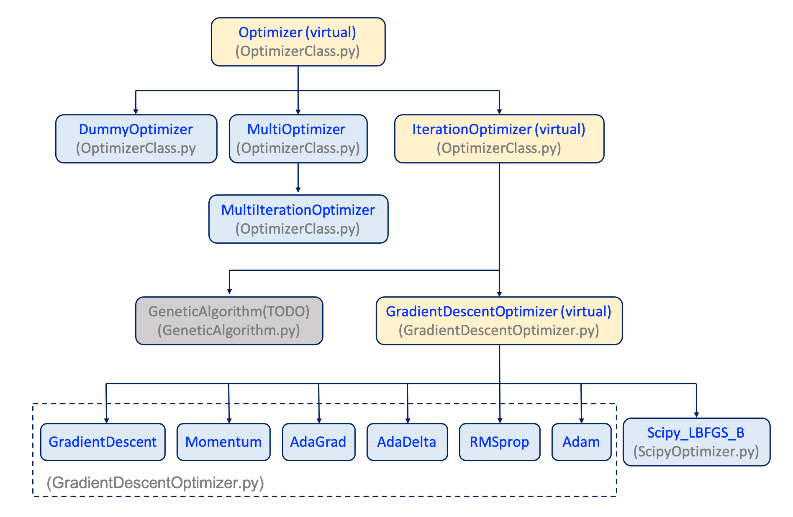

# Optimizer
**Optimizer** is a module related to optimization method. 
There are two different types of optimizer. 
* class-based    : OptimizerClass.py, GradientDescentOptimizer.py, ScipyOptimizer.py, GeneticAlgorithm.py
* function-based : myLearner.py 

Copyright (c) 2020-2022 Wei-Kai Lee. All rights reserved 
## Requirements
* numpy
* scipy

## references
[1]: https://zhuanlan.zhihu.com/p/22252270  
[2]: https://zh.d2l.ai/chapter_optimization/adadelta.html  

## class based
(A) `Optimizer(target_fun=None, name:str=""): virtual class`  
base class of optimizer  

(a) parameters 
* `target_fun`: target function 
* `name`: the name of optimizer 

(b) utility function 
* `.save_parameter(savefilename:str =None, savefilepath:str ='./') ->self`: save parameters into json file 
* `.read_parasmeter(filename:str, filepath:str = './')->self`: read parameters from json file 
* `.print_parameter()->self`: print the parameter information 
* `.print_state()->self`: print the state of optimizer 
* `.state_reset()->self`: reset the optimizer. Because the optimizer would save the results when optimizing, the data would be clear in this step 

execution function 
* `.optimize(x_init:np.ndarray)->np.ndarray`: start optimization  

(c) property
* `.target_fun (setter)`: target function, is a callabele function with a single value (i.e. y = obj.target_fun(x) ) 
* `.optimized_flag -> bool`: whether the optimizer has been optimized or not 
* `.optimized_x -> numpy.ndarray`: the x value in current state (default: None) 
* `.optimized_y -> numpy.ndarray`: the y value in current state (default: None) 

(B) `IterationOptimizer(target_fun=None, name:str='', max_iter:int= 1e3, print_iter_flag:bool=True, print_every_iter:int=10 save_history_flag:bool=False): virtual class` 
a derived class of **Optimizer**, a virtual class related to iteration optimizing algorithm 

(a) parameters 
* `target_fun`: target function 
* `name`: the name of optimizer 
* `max_iter`: maximum iteration 
* `print_iter_flag`: whether to print the optimizing information when optimzing 
* `print_every_iter`: print the optimizing information in every N step 
* `save_history_flag`: whether to save the history when optimizing 

(b) utility 
* `.reset_history()->self` : reset the history of optimization
* `.save_history(savefilename:str=None, savefilepath:str='./')->self`: save the history of optimization 
* `.plot_history(savefilename:str=None, savefilepath:str='./')->self`: plot the history of optimization 
* 
(c) property 
* `.history_dict -> dict`: history dictionary 
* `.max_iter (setter) -> int`: maximum iteration 
* `.counter (setter) -> int`: counter 
* `.print_iter_flag (setter) -> bool`: whether to print the optimizing information when optimzing 
* `.print_every_iter (setter) -> int`: print the optimizing information in every N step 
* `.save_history_flag (setter) -> bool`: save_history_flag: whether to save the history when optimizing 

(d) protected function while optimizing 
* `._pre_iteration(x_init:np.ndarrat) -> self`: to prepare the parameters before iteration start 
* `._add_one_to_history() -> self`: to add the information into history in one step 
* `._print_one() -> self (virtual)`: to print the information in one step 
* `._updata_one() -> self (virtual)`: to update the self._x and self._y value 
* `._termination() -> bool (virtual)`: whether the optimizer is terminated or not 
* `._post_iteration() -> self`: function after the iteration 
        

(C) `GradientDescentOptimizer(target_fun=None, fun_gradient=None, name:str='', max_iter:int= 5e4, print_iter_flag:bool=True, print_every_iter:int=10, save_history_flag:bool=False, dx:float=1e-10, tol:float=1e-5)): virtual class` 
a derived class of **IterationOptimizer**, a virtual class related to gradient descent method 

(a) parameter 
* `target_fun`: target function 
* `fun_gradient`: the gradient of target function if fun_gradient is None, the optimizer would use -two-point- method to do the numerical gradient. 
There are two types of output 
a. dy_dx = fun_gradient(x) 
b. y, dy_dx = fun_gradient(x) (faster) 
, where dy_dx is the gradient of target_function with the same size of x and y is the output of target_function. 
* `name:` the name of optimizer 
* `max_iter`: maximum iteration 
* `print_iter_flag`: whether to print the optimizing information when optimzing 
* `print_every_iter`: print the optimizing information in every N step 
* `save_history_flag`: whether to save the history when optimizing 
* `dx`: delta x when numerical gradient calculation 
* `tol`: tolerarance 
the optimizer would stop when it achieve maximum iteration or the maximum absolute x difference in a step is smaller than tol 

(b) utility 
* `.gradient(x:np.ndarray)`: the gradient of target function 

(c) property 
* `.fun_gradient (setter)`: the gradient of target function 
If fun_gradient is None, the optimizer would use -two-point- method to do the numerical gradient.  
There are two types of output 
a. dy_dx = fun_gradient(x) 
b. y, dy_dx = fun_gradient(x) (faster) 
, where dy_dx is the gradient of target_function with the same size of x and y is the output of target_function. 
* `.dx_num_grad (setter) -> float`: delta x when numerical gradient calculation 
* `.tol (setter) -> float`: tolerarance 

(D) `DummyOptimizer(target_fun=None, name:str='Dummy')` 
a derived class of Optimizer that do nothing,  
optimizer.optimze(x) would directly return x and set the optimizer's state 

(a) parameters 
* `target_fun`: target function 
* `name`: the name of optimizer 
    
(E) `MultiOptimizer(target_fun=None, name:str='MultiOptimizer', optimizer_list = None)` 
a derived calss of Optimizer that can combine different optimizer in the order in the optimizer_list 

(a) parameters 
* `target_fun`: target function 
* `name`: the name of optimizer 
* `optimizer_list`: a list of optimizer, when .optimize(x) the target function, MultiOptimizer would follow the same order in optimizer_list to optimize the target function  

(b) utility 
* `.__iter__`: when iterate the MultiOptimizer, it would return the optimizer stored optimizer_list 

(c) property 
* `.optimizer_list (setter)` -> list[Optimizer] 

(F) `GradientDescent(target_fun=None, fun_gradient=None, name:str='GradientDescent', max_iter:int= 5e4, print_iter_flag:bool=True, print_every_iter:int=10, save_history_flag:bool=False, dx:float=1e-10, tol:float=1e-5, lr:float=1e-2)` 
a derived class of GradientDescentOptimizer, using normal gradient descent method 

(a) parameter 
see the input of GradientDescentOptimizer 
* `lr`:  learning_rate 

(b) property 
* `.learning_rate (setter) -> float`: learning rate 

(G) `Momentum(target_fun=None, fun_gradient=None, name:str='Momentum', max_iter:int= 5e4, print_iter_flag:bool=True, print_every_iter:int=10, save_history_flag:bool=False,dx:float=1e-10, tol:float=1e-5, v_init:float=0.0, lr:float=0.001, beta:float=0.9))` 
a derived class of GradientDescentOptimizer, using momentum method 

(a) parameter 
see the input of GradientDescentOptimizer 
* `v_init`: initial velocity 
* `lr`:  learning_rate 
* `beta`: attenuating factor 

(b) property 
* `.v_init (setter) -> float`: initial velocity 
* `.learning_rate (setter) -> float`: learning rate 
* `.beta (setter) -> float`: attenuating factor 

(H) `AdaGrad(target_fun=None, fun_gradient=None, name:str='AdaGrad', max_iter:int= 5e4, print_iter_flag:bool=True, print_every_iter:int=10, save_history_flag:bool=False, dx:float=1e-10, tol:float=1e-5, epsilon:float=1e-8, lr:float=0.5)` 
a derived class of GradientDescentOptimizer, using AdaGrad method 

(a) parameter 
see the input of GradientDescentOptimizer 
* `epsilon`: deniminator factor 
* `lr`:  learning_rate 

(b) property 
* `.epsilon (setter) -> float`: deniminator factor 
* `.learning_rate (setter) -> float`: learning rate 

(I) `AdaDelta(target_fun=None, fun_gradient=None, name:str='AdaDelta',max_iter:int= 5e4, print_iter_flag:bool=True, print_every_iter:int=10, save_history_flag:bool=False, dx:float=1e-10, tol:float=1e-5, rho:float=0.9, epsilon:float=1e-8)` 
a derived class of GradientDescentOptimizer, using AdaDelta method 

(a) parameter 
see the input of GradientDescentOptimizer 
* `rho`: rho 
* `epsilon`:  epsilon 

(b) property 
* `.rho (setter)` -> float: rho 
* `.epsilon (setter)` -> float: epsilon 

(J) `RMSprop(target_fun=None, fun_gradient=None, name:str='RMSprop', max_iter:int= 5e4, print_iter_flag:bool=True, print_every_iter:int=10, save_history_flag:bool=False,dx:float=1e-10, tol:float=1e-5, rho:float=0.9, epsilon:float=1e-8, lr:float=0.01)` 
a derived class of GradientDescentOptimizer, using RMSprop method 

(a) parameter 
see the input of GradientDescentOptimizer 
* `rho`: rho 
* `epsilon`:  epsilon 
* lr: learning rate 

(b) property 
* `.rho (setter) -> float`: rho 
* `.epsilon (setter) -> float`: epsilon 
* `.learning_rate (setter) -> float`: learning rate 

(K) `Adam(target_fun=None, fun_gradient=None, name:str='Adam', max_iter:int= 5e4, print_iter_flag:bool=True, print_every_iter:int=10, save_history_flag:bool=False, dx:float=1e-10, tol:float=1e-5, beta1:float=0.9, beta2:float=0.999, epsilon:float=1e-8, lr:float=0.1)` 
a derived class of GradientDescentOptimizer, using Adam method 

(a) parameter 
see the input of GradientDescentOptimizer 
* `beta1`: beta1 
* `beta2:`  beta2 
* `epsilon`:  epsilon 
* `lr`: learning rate 

(b) property 
* `.beta1 (setter) -> float`: beta1 
* `.beta2 (setter) -> float`: beta2 
* `.epsilon (setter) -> float`: epsilon 
* `.learning_rate (setter) -> float`: learning rate 

(L) `Scipy_LBFGS_B(target_fun=None, fun_gradient=None, name:str='Scipy_LBFGS_B', max_iter:int= 5e4, print_iter_flag:bool=True, print_every_iter:int=1, save_history_flag:bool=False, dx:float=1e-10, ftol:float=1e-11, gtol:float=1e-08, eps:float=1e-08, bnd:tuple=(0,None)` 
a derived class of GradientDescentOptimizer, using scipy.optimize and L-BFGS-B to do the optimization 

(a) parameter 
* `dx`, `ftol`, `gtol`, `eps`: optimizing parameters in [scipy optimze L-BFGS-B](https://docs.scipy.org/doc/scipy/reference/optimize.minimize-lbfgsb.html) 

(b) property 
* `.dx (setter) -> float`: dx 
* `.ftol (setter) -> float`: ftol 
* `.gtol (setter) -> float`: gtol 
* `.eps (setter) -> float`: eps 

(M) `GeneticAlgorithm (TODO)` 

### Hierarchy

<strong>FIG. A. Hierarchy.</strong>

### example 
in main in GradientDescentOptimizer.py, ScipyOptimizer.py 

## function based 
(A) Utility 
- `LinearFittor(A, yi)` : pseudoinverse 
- `ParameterSavor(fpath, fname, varDict)`
- `ResultsSavor(a_new, count, countList, diffList, a_history, LossList, savefilepath, savefilename)` 
    
(B) Optimization Function 

(a) usage 
`a_new, count, countList, diffList, a_history, LossList = fun(dfda_f_fun, a_init, ..., difffun, MSGCount)` 

- `StochasticGradientDescent(dfda_f_fun, a_init, learning_rate=0.01, tol=1e-5, iter_TOL=5e4, MSGOPENBOOL=True, difffun=diffFun, MSGCount=100)` 
- `Momentum(dfda_f_fun, a_init, v_init=0.0, learning_rate=0.001, beta=0.9, tol=1e-5, iter_TOL=5e4, MSGOPENBOOL=True, difffun=diffFun, MSGCount=100)` 
- `AdaGrad(dfda_f_fun, a_init, epsilon=1e-8, learning_rate=0.5, tol=1e-5, iter_TOL=5e4, MSGOPENBOOL=True, difffun=diffFun, MSGCount=100)` 
- `AdaDelta(dfda_f_fun, a_init, rho=0.9, epsilon=1e-8, tol=1e-5, iter_TOL=5e4, MSGOPENBOOL=True, difffun=diffFun, MSGCount=100)` 
- `RMSprop(dfda_f_fun, a_init, rho=0.9, epsilon=1e-8, learning_rate=0.01, tol=1e-5, iter_TOL=5e4, MSGOPENBOOL=True, difffun=diffFun, MSGCount=100)` 
- `Adam(dfda_f_fun, a_init, beta1=0.9, beta2=0.999, epsilon=1e-8, learning_rate=0.1, tol=1e-5, iter_TOL=5e4, MSGOPENBOOL=True, difffun=diffFun, MSGCount=100)` 
    
(b) parameters
`dfda_f_fun` is a function with input a and the output is (dfda, f), where f is the target function and dfda is the gradient of the target function. 
*** `f` is a single value 
*** `dfda` is a numpy ndarray with the same size of a 
`a_init`   : the initial condition of a 
`...`      : parameters related to the algorithm 
`diffun`   : difference function (default: diffun = lambda a,b: np.max(np.abs(a-b))) 
`MSGCount` : print iteration information in every MSGCount count 

(c) returns 
`a_new`     : the optimized a  
`count`     : total iteration 
`countList` : iteration number 
`diffList`  : difference in each step 
`a_history` : history of a 
`LossList`  : history of loss function 

(C) example 
in Test.py 
